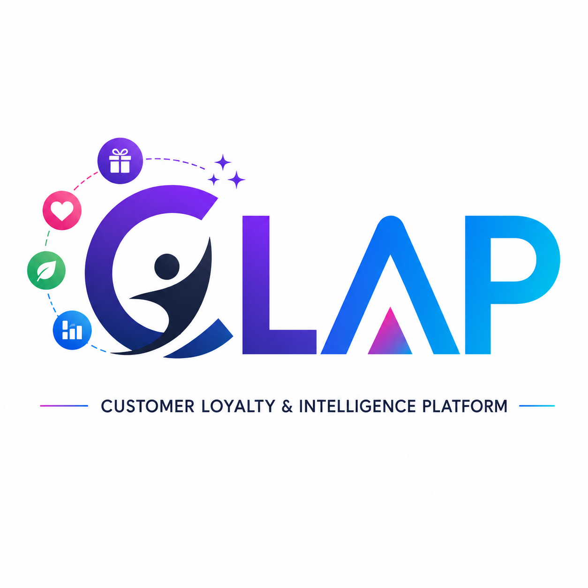

# CLAP — Customer Loyalty & Intelligence Platform

<div align="center">
  
</div>

Enterprise documentation for an **AI personalization and promotional offer engine** built for Fortune 100 (and equivalent) brands.

CLAP helps marketing, growth, and CRM teams **attract customers**, **match the right person to the right offer**, and **promote those offers** across owned and partner channels—with eligibility.

It is **not** a loyalty-catalog product first. Loyalty, referrals, and gamification are optional **offer rails**.

```
Customer + context  →  Personalize & rank offers  →  Promote on channels  →  Convert  →  Learn
```

| Item | Value |
| --- | --- |
| Product | CLAP (Customer Loyalty & Intelligence Platform) |
| GTM | B2B enterprise SaaS / dedicated tenant per brand portfolio |
| Primary cloud | AWS |
| Docs status | v0.1 draft |
| MVP horizon | 1-month brand pilot |

## Documentation portal

| Audience | Start here |
| --- | --- |
| Executive / CMO | [Executive presentation](docs/10-executive/01-executive-presentation.md) · [Business case](docs/01-product/03-business-case.md) · [Success metrics](docs/09-implementation/06-[...]
| Product | [Vision](docs/01-product/01-product-vision.md) · [PRD](docs/01-product/07-prd.md) · [MVP plan](docs/09-implementation/02-mvp-plan.md) |
| Architecture | [High-level design](docs/04-architecture/03-high-level-design.md) · [Microservices](docs/04-architecture/01-microservice-architecture.md) |
| Developers | [OpenAPI](openapi/) · [Event catalog](docs/05-api/01-event-catalog.md) · [Developer portal requirements](docs/02-requirements/01-functional-requirements.md) |
| Security / Legal | [Security architecture](docs/07-security-compliance/01-security-architecture.md) · [Compliance](docs/07-security-compliance/02-compliance.md) |
| Delivery | [Roadmap](docs/09-implementation/01-roadmap.md) · [CI/CD](docs/08-devops/02-cicd-pipeline.md) |

### All 42 deliverables

1. [Product vision](docs/01-product/01-product-vision.md)
2. [Product strategy](docs/01-product/02-product-strategy.md)
3. [Business case](docs/01-product/03-business-case.md)
4. [Customer personas](docs/01-product/04-customer-personas.md)
5. [Market research](docs/01-product/05-market-research.md)
6. [Competitive analysis](docs/01-product/06-competitive-analysis.md)
7. [PRD](docs/01-product/07-prd.md)
8. [Functional requirements](docs/02-requirements/01-functional-requirements.md)
9. [Non-functional requirements](docs/02-requirements/02-non-functional-requirements.md)
10. [User stories](docs/02-requirements/03-user-stories.md)
11. [Acceptance criteria](docs/02-requirements/04-acceptance-criteria.md)
12. [UI/UX designs](docs/03-ux/01-ui-ux-designs.md)
13. [Information architecture](docs/03-ux/02-information-architecture.md)
14. [User journey maps](docs/03-ux/03-user-journey-maps.md)
15. [Wireframes](docs/03-ux/04-wireframes.md)
16. [High-fidelity UI designs](docs/03-ux/05-hifi-designs.md)
17. [Design system](docs/03-ux/06-design-system.md)
18. [Microservice architecture](docs/04-architecture/01-microservice-architecture.md)
19. [Low-level design](docs/04-architecture/02-low-level-design.md)
20. [High-level design](docs/04-architecture/03-high-level-design.md)
21. [Database design](docs/04-architecture/04-database-design.md)
22. [API specifications](openapi/)
23. [Event catalog](docs/05-api/01-event-catalog.md)
24. [AI agent architecture](docs/06-ai/01-ai-agent-architecture.md)
25. [AI prompt library](docs/06-ai/02-prompt-library.md)
26. [Security architecture](docs/07-security-compliance/01-security-architecture.md)
27. [Compliance](docs/07-security-compliance/02-compliance.md)
28. [DevOps architecture](docs/08-devops/01-devops-architecture.md)
29. [CI/CD pipeline](docs/08-devops/02-cicd-pipeline.md)
30. [Testing strategy](docs/08-devops/03-testing-strategy.md)
31. [Quality engineering](docs/08-devops/04-quality-engineering.md)
32. [Automation framework](docs/08-devops/05-automation-framework.md)
33. [Performance strategy](docs/08-devops/06-performance-strategy.md)
34. [Disaster recovery](docs/08-devops/07-disaster-recovery.md)
35. [Monitoring strategy](docs/08-devops/08-monitoring-strategy.md)
36. [Implementation roadmap](docs/09-implementation/01-roadmap.md)
37. [MVP plan](docs/09-implementation/02-mvp-plan.md)
38. [Enterprise release plan](docs/09-implementation/03-enterprise-release-plan.md)
39. [Cost estimation](docs/09-implementation/04-cost-estimation.md)
40. [Risk assessment](docs/09-implementation/05-risk-assessment.md)
41. [Success metrics](docs/09-implementation/06-success-metrics.md)
42. [Executive presentation](docs/10-executive/01-executive-presentation.md)

## Branding

Documentation uses placeholders (`Acme`, `{tenant}`, `{brand}`). Do not name a bureau or loyalty vendor as the product owner. File paths must not contain vendor names.

## License

Internal draft. Not for external distribution until legal review.
