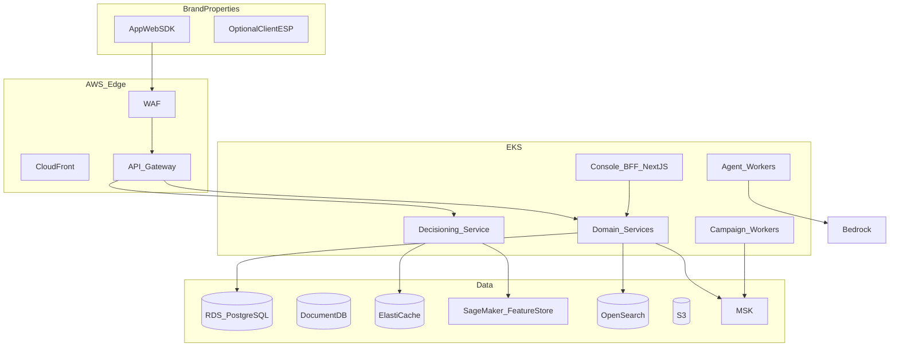

# High-level design

## Context

CLAP is a multi-tenant AWS platform. Fortune 100 brands integrate via **decisioning API**, **event ingest**, **webhooks**, and a **marketer console**. The brand’s app/web remains the consumer UX.

## Logical view

## Decisioning path (hot)

1. SDK/API → API Gateway → Decisioning service.  
2. Load policy + candidate offers from Redis (tenant+placement).  
3. Load features (profile snippet) from Redis/Feature Store.  
4. Filter eligibility, consent, caps, stacking, holdout.  
5. Rank (rules MVP; model later).  
6. Emit `decision.made` (async).  
7. Return payload.

If ranker or feature store fails: **rules-only on cached candidates** (degraded mode).

## Campaign path (warm)

Scheduler/trigger → audience resolve → consent → personalize payload (may call decide) → SES/SNS → events.

## Integration stance

- **In:** identity keys, traits, events from CDP/CRM/commerce.  
- **Out:** webhooks, audience export (GA), conversion acknowledgements.

## Tenancy

`tenant_id` on all rows; RLS. F100 dedicated EKS/RDS option in enterprise plan.

## Key ADRs

| ADR | Decision |
| --- | --- |
| ADR-001 | AWS primary |
| ADR-002 | PostgreSQL system of record for offers, campaigns, ledger of grants |
| ADR-003 | Redis + Feature Store for decide path |
| ADR-004 | MSK for async; not dual-write business truth |
| ADR-005 | Bedrock for copilot; no PII in prompts by policy |
| ADR-006 | Decisioning owns ranking; commerce owns redemption |
